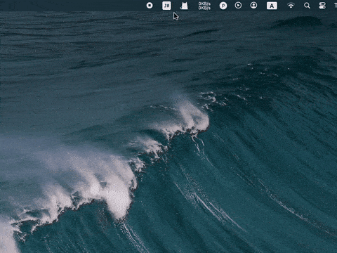

# JustTodo <image src="./resources/TrayIcon.svg" style="width: 24px; height: 24px; just"> <image src="./resources/AppIcon.svg" style="width: 24px; height: 24px;">

## Basic usage

## Why make this app?
In fact, I have long wanted to create such an app. Mainly, when writing code, I often have fleeting ideas. Recording them casually might mean waiting a long time to find time to implement them. This requires a to-do app. I have tried various to-do apps before, but most have some issues, such as:
1. **Convenience**: While working, the desktop is usually cluttered with many application windows, and many to-do apps cannot be opened/closed casually. You need to find it among a bunch of windows;
2. **Simplicity**: Most to-do apps have too many features, which makes the operation more complicated and not intuitive enough. Of course, this is the inevitable trend for commercial software. If they don't continuously develop new features, the development team will have to lay off staff. Therefore, product managers have to create enough demands;
3. **Economy**: Similar to the previous issue, commercialization requires profitability. This means the app needs to be paid or offer premium services. This is understandable for people with complex needs, as they get what they need from these apps. However, for someone like me, who just needs simple recording, I have no motivation to pay for so many complex features;
4. **Aesthetics**: I have found apps that solve the above three problems, but the UI is rather simplistic and not aesthetically pleasing. Every time I open it, I feel a bit put off. It is likely developed by someone like me who can't stand the above three issues and didn't spend much effort considering the UI aesthetics.

In response to the aforementioned issues, my approach to addressing them is as follows:
1. **Convenience**: The app can be accessed from the menu bar tray, allowing you to easily open it regardless of how many windows are piled up on your desktop;
2. **Simplicity**: Functions are strictly controlled; no features are added arbitrarily, retaining only the most basic recording and operation functions;
3. **Economy**: Open-source and free;
4. **Aesthetics**: Adopting a Material Design style ensures a visually pleasing and fundamentally sound design.

## Future plan
1. **Launch on boot**: Due to the relevant system limitations, this may not be easy；
2. **CloudKit sync**: Due to the relevant Applet limitations, this may not be easy;
3. **Logo for tabs**: Add vector logos on tab;
4. **Indenpendent tab on menu bar**: Make some tabs indenpendent on menu bar;

If you want any more features, leave message at **[Discussions](https://github.com/boybeak/JustTodo/discussions)**.
